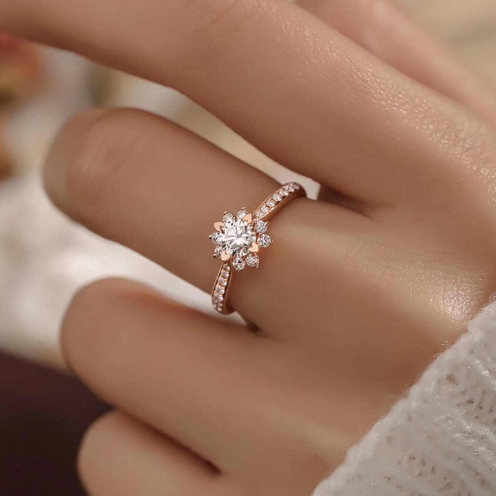
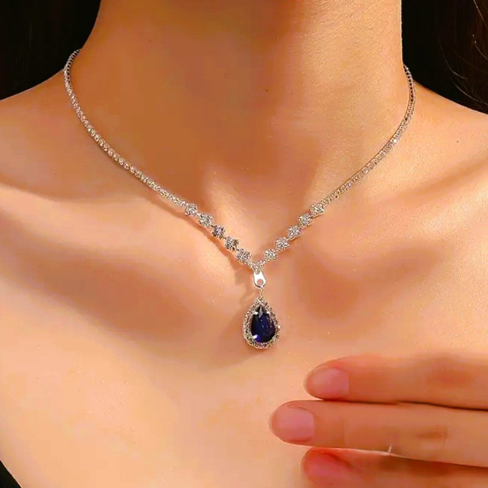
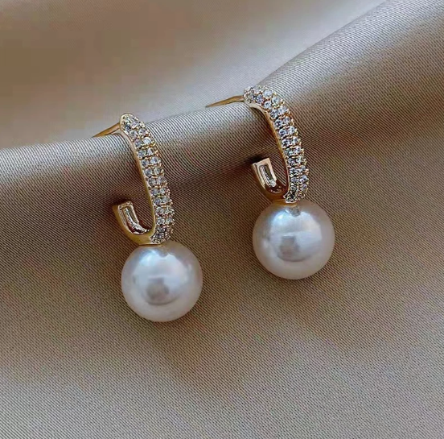
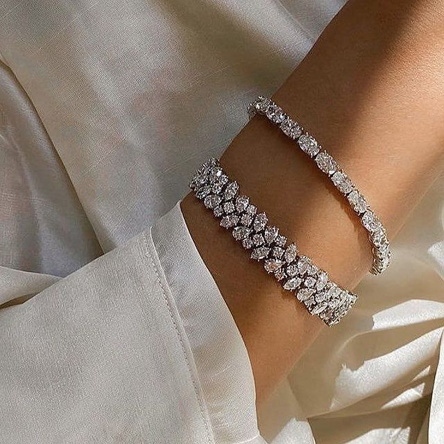

# Ex02 Commercial Website
## Date:31/7/2026

## AIM
To create a commercial website using CSS Flexbox.

## ALGORITHM
### STEP 1
Create an HTML file (index.html)

### STEP 2
Create a CSS file (style.css)

### STEP 3
Include a navigation bar with links to different sections.

### STEP 4
Add structured sections for Homepage, Products / Services, About Us, Contact Details and User Account.

### STEP 5
Include social media links at the footer with copyright information.

### STEP 6
Define global styles for fonts, colors, and layout.

### STEP 7
Style the header, navigation bar, and sections.

### STEP 8
Use Flexbox for layout design.

### STEP 9
Add hover effects and transitions for interactivity.

### STEP 10
Add Images and Media.

### STEP 11
Use optimized images for a professional look.

### STEP 12
Open the HTML file in a browser to check layout and functionality.

### STEP 13
Fix styling issues and refine content placement.

### STEP 14
Deploy the website.

### STEP 15
Upload to GitHub Pages for free hosting.

## PROGRAM
HTML
```
<!DOCTYPE html>
<html lang="en">
<head>
    <meta charset="UTF-8">
    <meta name="viewport" content="width=device-width, initial-scale=1.0">
    <title>Royal Gems | Luxury Jewelry</title>
    <link rel="stylesheet" href="style.css">
</head>
<body>

<!-- Header -->
<header>
    <div class="logo">
        <h1>Royal Gems</h1>
    </div>

    <nav>
        <ul>
            <li><a href="#home">Home</a></li>
            <li><a href="#products">Collections</a></li>
            <li><a href="#about">About</a></li>
            <li><a href="#testimonials">Reviews</a></li>
            <li><a href="#contact">Contact</a></li>
            <li><a href="#account">Account</a></li>
        </ul>
    </nav>
</header>

<!-- Hero Section -->
<section class="hero" id="home">

    <div class="hero-text">
        <h2>Timeless Elegance</h2>

        <p>
            Discover handcrafted jewelry that reflects beauty,
            elegance and luxury for every occasion.
        </p>

        <button>Shop Now</button>
    </div>

    <div class="hero-image">
        
    </div>

</section>

<!-- Products -->

<section id="products">

<h2 class="title">Our Collections</h2>

<div class="products">

<div class="card">



<h3>Diamond Ring</h3>

<p>₹89,000</p>

<button>Buy Now</button>

</div>

<div class="card">



<h3>Gold Necklace</h3>

<p>₹2,49,999</p>

<button>Buy Now</button>

</div>

<div class="card">



<h3>Pearl Earrings</h3>

<p>₹74,999</p>

<button>Buy Now</button>

</div>

<div class="card">



<h3>Luxury Bracelet</h3>

<p>₹1,49,999</p>

<button>Buy Now</button>

</div>

</div>

</section>

<!-- About -->

<section id="about">

<h2>About Royal Gems</h2>

<p>

Royal Gems has been creating timeless jewelry for generations.
Every piece is crafted with precision, passion, and premium
quality materials. Our mission is to make every customer feel
special with elegant jewelry collections.

</p>

</section>

<!-- Testimonials -->

<section id="testimonials">

<h2>Customer Reviews</h2>

<div class="reviews">

<div class="review">
⭐⭐⭐⭐⭐
<p>"Absolutely stunning quality!"</p>
<h4>- Priya</h4>
</div>

<div class="review">
⭐⭐⭐⭐⭐
<p>"Beautiful designs and quick delivery."</p>
<h4>- Rahul</h4>
</div>

<div class="review">
⭐⭐⭐⭐⭐
<p>"Worth every penny. Highly recommended."</p>
<h4>- Ananya</h4>
</div>

</div>

</section>

<!-- Contact -->

<section id="contact">

<h2>Contact Us</h2>

<p>Email : support@royalgems.com</p>

<p>Phone : +91 9876543210</p>

<p>Address : Chennai, Tamil Nadu, India</p>

</section>

<!-- User Account -->

<section id="account">

<h2>User Login</h2>

<form>

<input type="text" placeholder="Username" required>

<input type="email" placeholder="Email" required>

<input type="password" placeholder="Password" required>

<button type="submit">Login</button>

</form>

</section>

<!-- Newsletter -->

<section class="newsletter">

<h2>Subscribe to Our Newsletter</h2>

<p>Get updates on exclusive offers and new arrivals.</p>

<input type="email" placeholder="Enter your email">

<button>Subscribe</button>

</section>


<footer>

<h3>Royal Gems</h3>

<div class="social">

<a href="#">Facebook</a>

<a href="#">Instagram</a>

<a href="#">Pinterest</a>

<a href="#">Twitter</a>

</div>

<p>© 2026 Royal Gems. All Rights Reserved.</p>

</footer>

</body>
</html>
```

CSS
```


*{
    margin:0;
    padding:0;
    box-sizing:border-box;
    font-family:Arial, Helvetica, sans-serif;
}

html{
    scroll-behavior:smooth;
}

body{
    background:#FFF8F3;
    color:#333;
    line-height:1.6;
}


header{
    background:#8B5E3C;
    color:white;
    display:flex;
    justify-content:space-between;
    align-items:center;
    padding:18px 60px;
    position:sticky;
    top:0;
    z-index:1000;
}

.logo h1{
    color:#FFD700;
    font-size:32px;
}

nav ul{
    display:flex;
    list-style:none;
}

nav ul li{
    margin-left:25px;
}

nav ul li a{
    color:white;
    text-decoration:none;
    font-size:18px;
    transition:.3s;
}

nav ul li a:hover{
    color:#FFD700;
}


.hero{
    display:flex;
    justify-content:space-between;
    align-items:center;
    padding:80px;
    flex-wrap:wrap;
}

.hero-text{
    flex:1;
}

.hero-text h2{
    font-size:55px;
    color:#8B5E3C;
    margin-bottom:20px;
}

.hero-text p{
    font-size:22px;
    margin-bottom:30px;
}

.hero-text button{
    padding:14px 35px;
    border:none;
    background:#D4AF37;
    color:white;
    font-size:18px;
    border-radius:8px;
    cursor:pointer;
    transition:.3s;
}

.hero-text button:hover{
    background:#B8860B;
    transform:scale(1.05);
}

.hero-image{
    flex:1;
    text-align:center;
}

.hero-image img{
    width:500px;
    max-width:100%;
    border-radius:20px;
    box-shadow:0 8px 20px rgba(0,0,0,.2);
}


.title{
    text-align:center;
    font-size:40px;
    color:#8B5E3C;
    margin-bottom:40px;
}

.products{
    display:flex;
    justify-content:center;
    flex-wrap:wrap;
    gap:30px;
    padding:20px 50px 80px;
}

.card{
    width:260px;
    background:white;
    border-radius:15px;
    overflow:hidden;
    box-shadow:0 5px 15px rgba(0,0,0,.15);
    transition:.4s;
    text-align:center;
}

.card:hover{
    transform:translateY(-10px);
}

.card img{
    width:100%;
    height:250px;
    object-fit:cover;
}

.card h3{
    margin-top:15px;
    color:#8B5E3C;
}

.card p{
    color:#D4AF37;
    font-size:22px;
    margin:15px 0;
    font-weight:bold;
}

.card button{
    margin-bottom:20px;
    padding:10px 25px;
    border:none;
    background:#8B5E3C;
    color:white;
    cursor:pointer;
    border-radius:5px;
    transition:.3s;
}

.card button:hover{
    background:#D4AF37;
}


#about{
    background:white;
    padding:80px;
    text-align:center;
}

#about h2{
    color:#8B5E3C;
    font-size:40px;
    margin-bottom:20px;
}

#about p{
    width:80%;
    margin:auto;
    font-size:20px;
}


#testimonials{
    padding:80px;
}

#testimonials h2{
    text-align:center;
    color:#8B5E3C;
    margin-bottom:40px;
    font-size:40px;
}

.reviews{
    display:flex;
    justify-content:center;
    flex-wrap:wrap;
    gap:30px;
}

.review{
    width:280px;
    background:white;
    padding:25px;
    border-radius:12px;
    text-align:center;
    box-shadow:0 5px 15px rgba(0,0,0,.15);
    transition:.3s;
}

.review:hover{
    transform:scale(1.05);
}

.review p{
    margin:15px 0;
}


#contact{
    background:white;
    padding:80px;
    text-align:center;
}

#contact h2{
    color:#8B5E3C;
    font-size:40px;
    margin-bottom:20px;
}

#contact p{
    font-size:20px;
    margin:10px;
}


#account{
    padding:80px;
    text-align:center;
}

#account h2{
    color:#8B5E3C;
    margin-bottom:25px;
    font-size:40px;
}

form{
    width:400px;
    max-width:95%;
    margin:auto;
    display:flex;
    flex-direction:column;
}

form input{
    padding:15px;
    margin:12px 0;
    border:1px solid #ccc;
    border-radius:5px;
    font-size:16px;
}

form button{
    padding:15px;
    border:none;
    background:#8B5E3C;
    color:white;
    font-size:18px;
    border-radius:5px;
    cursor:pointer;
    transition:.3s;
}

form button:hover{
    background:#D4AF37;
}


.newsletter{
    background:#D4AF37;
    color:white;
    text-align:center;
    padding:70px;
}

.newsletter h2{
    margin-bottom:15px;
    font-size:36px;
}

.newsletter p{
    margin-bottom:20px;
}

.newsletter input{
    width:320px;
    max-width:90%;
    padding:15px;
    border:none;
    border-radius:5px;
}

.newsletter button{
    padding:15px 30px;
    margin-left:10px;
    border:none;
    background:#8B5E3C;
    color:white;
    cursor:pointer;
    border-radius:5px;
    transition:.3s;
}

.newsletter button:hover{
    background:#6b4428;
}


footer{
    background:#8B5E3C;
    color:white;
    text-align:center;
    padding:40px;
}

footer h3{
    color:#FFD700;
    margin-bottom:15px;
    font-size:30px;
}

.social{
    margin:20px 0;
}

.social a{
    text-decoration:none;
    color:white;
    margin:0 15px;
    font-size:18px;
    transition:.3s;
}

.social a:hover{
    color:#FFD700;
}


@media(max-width:900px){

header{
    flex-direction:column;
}

nav ul{
    flex-direction:column;
    text-align:center;
    margin-top:20px;
}

nav ul li{
    margin:10px 0;
}

.hero{
    flex-direction:column;
    text-align:center;
}

.hero-text h2{
    font-size:42px;
}

.hero-image{
    margin-top:40px;
}

.products{
    padding:20px;
}

.review{
    width:100%;
}

.newsletter button{
    margin-top:15px;
    margin-left:0;
}
}
```

## OUTPUT


## RESULT
The program for creating commercial website using CSS Flexbox is executed successfully.
